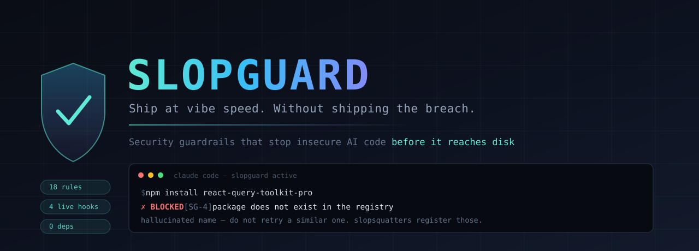
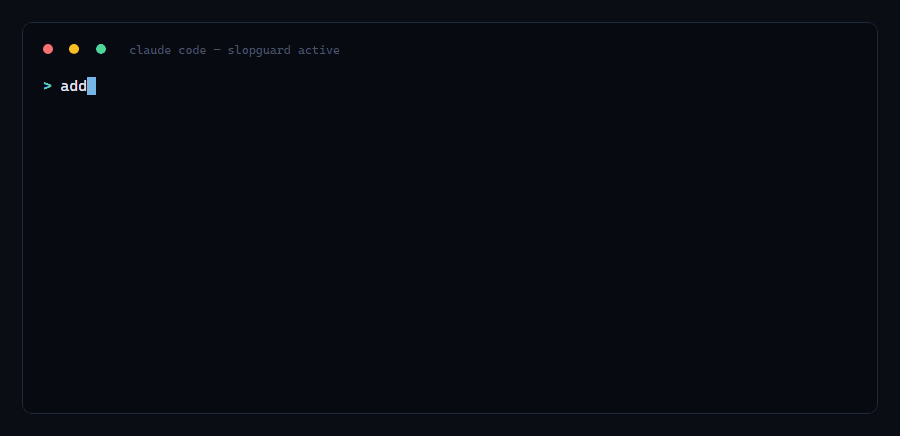

<p align="center">
  
</p>

<p align="center">
  <a href="#install"></a>
  <a href="test/run-tests.mjs"></a>
  <a href="docs/THREATS.md"></a>
  
  <a href="LICENSE"></a>
</p>

<p align="center">Created by <a href="https://www.linkedin.com/in/manpreet17/">Manpreet Singh</a> · Part of <a href="https://singhlabs.dev/slopguard/">Singh Labs</a></p>

---

Your AI writes code faster than you can read it. That is the point, and it is not
going away.

The problem is that nobody reads it. Veracode tested over 100 models and **45% of
generated code introduced an OWASP Top 10 vulnerability** — and newer, larger
models did not do better. Escape.tech scanned 5,600 production apps built on
Lovable, Bolt and Base44 and found **2,000+ vulnerabilities and 400+ live exposed
secrets.** Georgia Tech's Vibe Security Radar has traced **74 CVEs to specific
AI-tool commits**, 35 of them in March 2026 alone.

Every existing tool tells you about this *after* the code exists. Scanners run in
CI. Reviews happen at the PR. WAFs sit in production. All of them are downstream of
the moment the vulnerability was created — and by then it is in your git history,
your build, and probably your deploy.

**Slopguard moves the check upstream, into the one second between "the model
produced it" and "it exists on disk."**

<p align="center">
  
</p>

That is not a linter warning you scroll past. The write did not happen.

Note the middle beat: the block hands the model a rule ID and a concrete fix, so
it corrects itself and moves on. Most of the time you don't do anything — you just
watch it get it right on the second try.

---

## Two layers

**1. `AGENTS.md` — 18 numbered rules.** A portable security constitution that
Claude Code, Cursor, Copilot, Windsurf, Cline, Aider and Codex all read. Drop it in
any repo. Works everywhere, enforces nothing.

**2. The Claude Code plugin — hooks that actually block.** Because advice the model
can ignore is not a control. Four hooks intercept tool calls in real time, deny the
unsafe ones, and hand the model the rule ID plus a concrete fix so it self-corrects
instead of guessing.

Rules teach. Hooks enforce. You want both.

---

## Install

```bash
# in Claude Code
/plugin marketplace add manpreet171/slopguard
/plugin install slopguard@slopguard
```

Then put the rules in whatever project you're working on:

```bash
curl -O https://raw.githubusercontent.com/manpreet171/slopguard/main/AGENTS.md
```

That's it. No config, no API key, no dependencies — the hooks are plain Node ESM
scripts using only the standard library. Restart Claude Code and the guards are live.

<details>
<summary>Local install, or without the plugin system</summary>

```bash
git clone https://github.com/manpreet171/slopguard
# in Claude Code:
/plugin marketplace add ./slopguard
/plugin install slopguard@slopguard
```

To wire the hooks manually instead, copy `plugins/slopguard/hooks/hooks.json` into
your `.claude/settings.json` and replace `${CLAUDE_PLUGIN_ROOT}` with the path to
`plugins/slopguard`.

Not using Claude Code at all? `AGENTS.md` alone still does real work in Cursor,
Copilot, Windsurf and Aider. See [Portable use](#portable-use).
</details>

---

## What gets blocked

Real output from the test suite in this repo — not mockups.

### A hardcoded key and a string-built query

```
✗ SLOPGUARD blocked this write to src/server/db.js — 2 unsafe pattern(s):

• [SG-1] Stripe live secret key
    found: sk_live_51H8…ijkX
    fix:   Move this to an environment variable or a secret manager, reference it
           via process.env, and rotate the exposed credential — assume it is
           already public.

• [SG-2] SQL built by string interpolation
    found: SELECT * FRO…ail}
    fix:   Use a parameterized query. Pass values as bound arguments, never
           concatenate them into the SQL string.
```

Note the redaction — Slopguard never echoes a live credential back into your
transcript.

### The `service_role` key in a React component

The single most catastrophic mistake in the Lovable/Bolt/Base44 class of app.

```
✗ SLOPGUARD blocked this write to src/lib/supabase.ts:

• [SG-6] Supabase service_role key in client-reachable code
    fix:   This file ships to the browser. A service_role key there bypasses every
           Row Level Security policy you wrote — any visitor gets full database
           access. Use the anon key on the client and keep privileged calls behind
           a server route or Edge Function.
```

### A hallucinated package

Slopguard queries npm and PyPI **before the install runs**. A 404 is a hallucination.

```
✗ SLOPGUARD blocked this install — [SG-4] 2 package(s) do not exist:

  • express-mongoose-helper-utils  (npm: 404 not found)
  • react-query-toolkit-pro        (npm: 404 not found)
```

A package that *does* exist but was published 11 days ago gets flagged too — that
is what a slopsquat looks like from the inside.

### Your own rule files, poisoned

Checked at session start, before the model reads them:

```
⚠ SLOPGUARD PRE-FLIGHT

  [SG-16] HIDDEN UNICODE in CLAUDE.md — line 1 (ZERO WIDTH SPACE, RIGHT-TO-LEFT OVERRIDE)
          This file steers the agent. Invisible characters here are the "Rules File
          Backdoor" technique: directives the model reads and a reviewer cannot see.

  [SG-16] MCP/SETTINGS CHANGED since last session: .mcp.json
          Diff it before you let the agent run. This is the MCPoison pattern
          (CVE-2025-54136): a previously-approved entry whose command was swapped.
```

---

## Why those four checks

Not arbitrary. Each maps to a documented, shipped attack:

| Guard | Defends against | Source |
|---|---|---|
| Registry verification before install | **Slopsquatting.** 19.7% of AI-recommended packages don't exist; 43% of the fake names recur on every re-run, so attackers mine models for them and register them. | [USENIX Security 2025](docs/THREATS.md#slopsquatting-hallucinated-packages-as-a-supply-chain) |
| Instruction-file scanning | **Rules File Backdoor.** Invisible Unicode in `CLAUDE.md` / `.cursor/rules` carries directives the model obeys and review can't see. Rule files get shared, so it propagates. | [Pillar Security](docs/THREATS.md#the-rules-file-backdoor) |
| Config drift detection | **MCPoison (CVE-2025-54136).** An approved MCP entry's command swapped silently in a shared repo → persistent RCE. | [Check Point](docs/THREATS.md#cve-2025-54136--mcpoison-cvss-72) |
| Write-time code inspection | **The 45%.** Secrets, injection, weak crypto, unsafe deserialization — the mechanical failures that repeat because nothing in the loop checks. | [Veracode](docs/THREATS.md#ai-generated-code-fails-security-tests-at-a-measurable-rate) |

Full evidence, with links to every primary source: **[docs/THREATS.md](docs/THREATS.md)**

> Worth saying plainly: Claude Code authored 27 of those 74 tracked CVEs — the
> largest single share. That is exactly why the guardrails belong here, in the tool
> doing the writing.

---

## The rules

| | | | |
|---|---|---|---|
| **SG-1** Secrets never in code | **SG-2** Parameterized queries only | **SG-3** No dynamic shell or eval | **SG-4** Verify every dependency |
| **SG-5** Hardened session cookies | **SG-6** Authz at the data layer | **SG-7** Object-level authz per route | **SG-8** Modern crypto and CSPRNG |
| **SG-9** Safe deserialization | **SG-10** CORS, CSRF, JWT | **SG-11** Constrained outbound (SSRF) | **SG-12** Rate limits and lockout |
| **SG-13** Errors leak nothing | **SG-14** Clean logs, no PII | **SG-15** Safe paths and uploads | **SG-16** Agent supply chain |
| **SG-17** Schema validation at edges | **SG-18** TLS verification stays on | | |

Nine are machine-enforced. The rest are yours — read **[AGENTS.md](AGENTS.md)**.

The rules are written *to the model*, in the second person, with the reasoning
included. That matters: a model that understands why `jwt.decode` is unsafe
generalizes to the next case. One that just pattern-matches a banned string does not.

---

## Skills and the red teamer

Three skills the model invokes automatically, or you can call directly:

```bash
/slopguard:threat-model    # before you build — assets, entry points, what a human must own
/slopguard:harden          # audit a feature against SG-1..SG-18, then fix it
/slopguard:preflight       # before deploy — git history, RLS, client bundle, CVEs
```

Plus an adversarial subagent that reviews as an attacker, not a linter:

```
@slopguard:redteam review the checkout flow
```

It looks where the money is first — object-level authorization, multi-tenancy
leaks, auth state machines, business logic — and reports only findings with a
concrete attack path. It is instructed to say "clean" when things are clean, and
never to pad a list.

---

## What Slopguard is not

A security tool that overstates its coverage is worse than none, because it
manufactures confidence. So, precisely:

- **Not a SAST replacement.** It catches high-confidence patterns at write time.
  Run Semgrep, CodeQL or Snyk in CI too. Different layer, different job.
- **It cannot find missing authorization.** No pattern matcher can — an absent
  check is not a pattern. That is what `/slopguard:harden` and the red team agent
  are for, and ultimately what human review is for.
- **It only sees what the agent writes.** Code you paste in yourself, or that
  arrives via `git pull`, is not inspected at write time.
- **The registry check needs network.** It fails open on timeout — a guard that
  blocks your work when the wifi drops is a guard you uninstall.
- **It is bypassable.** Anything determined to get around it will. It is a
  guardrail, not a sandbox. It exists to make the safe path the default path.

It does not phone home, collect telemetry, or send your code anywhere. The only
network calls are `registry.npmjs.org` and `pypi.org`, to ask whether a package
exists.

---

## Tuning

Too noisy? Every rule lives in one readable file:
[`plugins/slopguard/scripts/rules.mjs`](plugins/slopguard/scripts/rules.mjs).
Patterns are marked `deny` (provably unsafe — blocks) or `ask` (heuristic — prompts
you). Move anything you disagree with, or add it to `ALLOWLIST_PATHS`.

Test files, `node_modules`, lockfiles and `.env.example` are already skipped.

```bash
npm test        # 47 cases: 22 must block, 4 must prompt, 21 must stay silent

# or check a single payload by hand
echo '{"tool_input":{"file_path":"a.js","content":"YOUR CODE"}}' \
  | node plugins/slopguard/scripts/guard-write.mjs
```

Nearly half the suite is dedicated to code that must *not* trip a rule —
parameterized queries, `process.env` reads, bcrypt, hardened cookies, anon keys,
`.env.example` placeholders. Those are the tests that matter.

If a rule fires on safe code, that's a bug worth an issue — false positives are how
guardrails get switched off, and a disabled guard defends nothing.

---

## Portable use

`AGENTS.md` is plain markdown with no Claude-specific syntax. It works as-is in:

| Tool | Where it goes |
|---|---|
| Claude Code | `AGENTS.md` or `CLAUDE.md` in project root |
| Cursor | `.cursor/rules/slopguard.mdc` or `.cursorrules` |
| GitHub Copilot | `.github/copilot-instructions.md` |
| Windsurf | `.windsurfrules` |
| Cline / Aider / Codex | `AGENTS.md` in project root |

Enforcement is Claude Code-only for now. Ports welcome.

---

## Repository layout

```
AGENTS.md                    the 18 rules — portable, drop in any repo
CLAUDE.md                    pointer so Claude Code loads them
docs/THREATS.md              every claim, with primary sources
plugins/slopguard/
  hooks/hooks.json           hook wiring
  scripts/
    rules.mjs                the entire detection library, one file
    guard-write.mjs          PreToolUse: Write | Edit | MultiEdit
    guard-bash.mjs           PreToolUse: Bash — registry verification
    guard-session.mjs        SessionStart: instruction + config integrity
  skills/                    threat-model, harden, preflight
  agents/redteam.md          adversarial reviewer
```

---

## Contributing

Most useful contributions, in order:

1. **A false positive.** Include the code that tripped it. These matter most.
2. **A missed pattern**, with a real-world example of it being exploited.
3. **A port** of the enforcement layer to Cursor or Copilot.
4. **A correction to [docs/THREATS.md](docs/THREATS.md).** If a number is wrong, it
   should be fixed or cut. Nothing in this repo is worth defending past its evidence.

---

## License

MIT. See [LICENSE](LICENSE).

---

<p align="center">
  Built by <b>Manpreet Singh</b><br>
  <a href="https://www.linkedin.com/in/manpreet17/">LinkedIn</a> ·
  <a href="https://medium.com/@singh.manpreet171900">Medium</a> ·
  <a href="mailto:singh.manpreet171900@gmail.com">Email</a>
</p>

<p align="center">
<sub>Vibe coding isn't the problem. Shipping it unread is.</sub>
</p>
